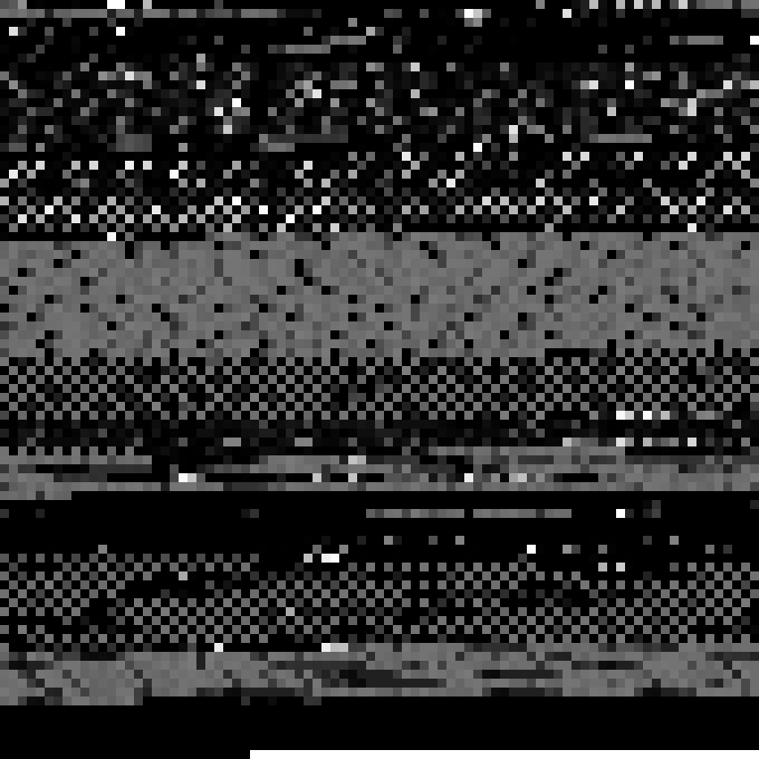

# NonBattleReadySteganography
Basically, iOS is walled-garden hell if you need to use it as a flashdrive type device, though, it does have a photo library. So, let's say your computer doesn't have Internet access and tethering is also not an option for you. However, luckily, you have an iPhone with an email and internet access! (Super niche situation, but hey, it happened and that's why this exists!) This turns binary files into portable network graphics - starting with a decompiler for future escapades and ease of conversion - that you can then import into your computer through the iOS photo library access.

AtrocitiesForFiles compiles the files to email to iPhone users without computer internet access.

CrimesAgainstJavaScript contains initial email instruction, html code, and the image to reconstruct the C# based decompiler, in addition to the C# decompiler.

From there, the sky is the limit and files can be exchanged freely.

